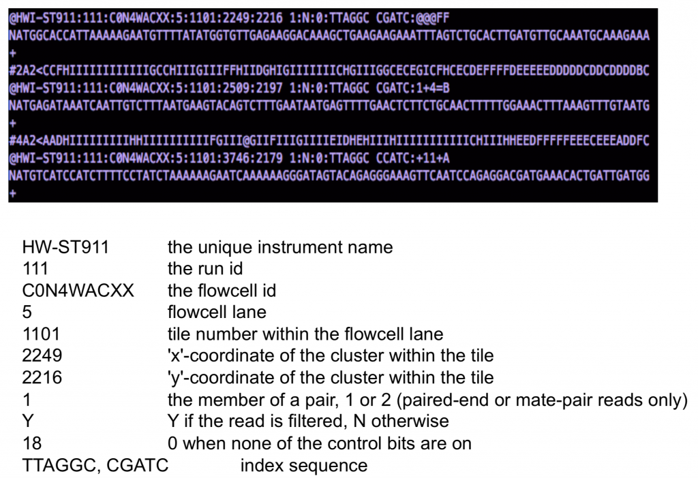
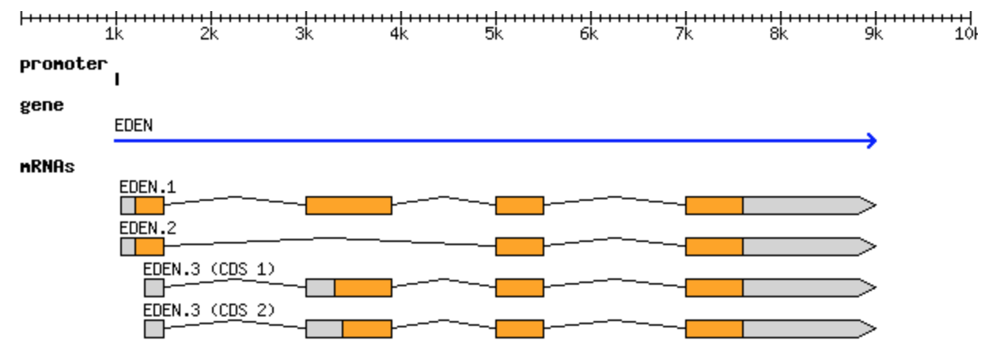

# Lecture 1. Introduction to RNA-Seq technology and data
[Previous Topic](../README.md)
[Next Topic](../Lecture02:SettingUp/)

## Learning objectives
- Get familiar with terminology of RNASeq/HTS (paired-end, single-end, cluster density, FastQ, index, etc).
- Understand Illumina's "Sequencing by synthesis" (SBS) technology.
- Set priorities when planning a sequencing experiment.
- Understand the basics of library prep for HTS.

## Reading Material
###**Here are some basics on [NGS technology and file formats]**(https://learn.gencore.bio.nyu.edu/ngs-file-formats/)


**Definitions:**
**read:** a single sequence produced from a sequencer
**library:** a collection of DNA fragments that have been prepared for sequencing. This generally refers to individual samples
**flowcell:** a chip on which DNA is loaded and provided to the sequencer
**lane:** one portion of a flow cell. Usually used for technical replicates or different samples
**run:** an entire sequencing reaction from start to finish
**NGS:** Next-generation sequencing refers to second generation sequencing where fragments of DNA are sequenced in parallel and reconstructed for the final sequence information

#### General Sequencing steps in NGS:
1. Sample collection and preparation
2. Amplification
3. BaseCalling

##### **1. Sample Collection and Preparation**
Nucleic acids from your sample of interested is isolated and purified. RNA is then sheared to a certain size, the product of interest is amplified and processed to cDNA, then sequencing adaptors are ligated (small fragments of DNA that are used to bind the molecules of interest on to the flowcell).

##### **2. Amplification**
The sample can be amplified in either single-end or paired-end sequencing. 

[Here is Ilumina's table on the difference between these sequencing choices](https://www.illumina.com/science/technology/next-generation-sequencing/plan-experiments/paired-end-vs-single-read.html)

<br>  **Paired-end sequencing:** <br>  
**Simple paired-end libraries:** Simple workflow allows generation of unique ranges of insert sizes
**Efficient sample use:** Requires the same amount of DNA as single-read genomic DNA or cDNA sequencing
**Broad range of applications:** Does not require methylation of DNA or restriction digestion; can be used for bisulfite sequencing
**Simple data analysis:** Enables high-quality sequence assemblies with short-insert libraries. A simple modification to the standard single-read library preparation process facilitates reading both the forward and reverse template strands of each cluster during one paired-end read. Both reads contain long-range positional information, allowing for highly precise alignment of reads

<br>  **Single-read sequencing:**  <br>  

**Cost-effective uses:** This solution delivers large volumes of high-quality data, rapidly and economically
**Specific applications:** Single-read sequencing can be a good choice for certain methods such as small RNA-Seq or chromatin immunoprecipitation sequencing (ChIP-Seq)

<br>  
Sequencing kits are getting cheaper by the decade, the general consensus seems to always go with paired-end sequencing with genomic assays if in the budget due to higher quality data. <br>  
  
##### **3. Sequencing**
[Illumina Sequencing by Synthesis (SBS) Workflow](https://youtu.be/fCd6B5HRaZ8?si=KBfoI6uNyxmuxgiR)
  
Sometimes you will hear people state that a sample occupies 2 lanes, this means that for an 8 lane flowcell, the remaining 6 will be utilized by other samples submitted by otheres. This is a way to drive down sequencing costs. This may be older terminology as I no longer hear lanes being referred. This may be due to sequencing studies needing need high read counts and the [capacity of each sequencing lane](https://online.stat.psu.edu/stat555/node/13/#:~:text=The%20basic%20sequencing%20unit%20is,the%20amount%20of%20sequencing%20done.)
  
>The basic sequencing unit is a "lane" which essentially holds one sequencing sample.  A set of lanes which are processed together is often called a "plate". A single RNA sample may be split across multiple lanes to increase the amount of sequencing done.  This is uncommon in current RNA-seq studies, because each lane can now sequence 100's of millions of RNA fragments, which is more than sufficient for RNA-seq, but it may be done in studies that need very high read counts.  
>...
> **From Lanes to Samples**
>Our units of analysis are features and RNA samples.  In many studies, sequencing lanes and samples are not the same.  Mapping identifies the features.  We also need to summarize by sample. In some studies, the RNA samples are split across several lanes.  It turns out that the error structure is preserved if we simply sum up the reads from each sample to obtain the total reads for each feature in the sample. In some studies, the RNA samples are barcoded and multiplexed so that several samples are sequenced together.  As the reads are mapped to the reference, the bar codes need to be read so that they can also be assigned to samples.


[Here is a forum link discussing lanes](https://www.biostars.org/p/48906/)
<br>  


[Here is a seconday link discussing lanes](https://bioinformatics.stackexchange.com/questions/4564/relationship-between-sequencing-lane-and-ngs-dataset)
  <br>
Other context regarding lane
A flow cell contains 8 lanes
Each lane contains 2 columns
Each column contains up to 50 tiles
Each tile is imaged 4 times per cycle, one image per base
Each image is 2.5-3.0 Mb, and ~115,000 images are produced per 36 cycles

#### File formats
##### **FastA**
Official FastA [documentation](https://blast.ncbi.nlm.nih.gov/Blast.cgi?CMD=Web&PAGE_TYPE=BlastDocs&DOC_TYPE=BlastHelp)
- This is the most basic format for reporting a sequence and is accepted by all sequence analysis programs.
- Contains 2 lines:
1. The first is the sequence header, which always starts with a ‘>’
- Everything from the beginning ‘>’ to the first whitespace is considered the sequence identifier. Everything after that is considered the sequence description (this can be metadata, machine serial number, read orientation, etc.)
2. The sequence itself 
- Note that the sequence can span multiple lines, depending on the length of the sequence.
  
**Softwares that use FastA** <br>  
- Reference genome
- DB query tools like BLAST and multiple-sequence alignment algorithms

<br>  **File generation**  <br>  
- Some NGS sequencers report in FastA
- Sanger Sequencers
- Most sequence databases store in FastA and is made available for download in this format
- Can be generated from FastQ files

This is what FastA looks like  


  
You can grab and explore a FastA file:  
Generally you will download a reference genome. You can find it here: ftp://ftp.wormbase.org/pub/wormbase/species/c_elegans/sequence/genomic/c_elegans.WS236.genomic.fa.gz
  
Download it onto the cluster in a new folder in your scratch called file_formats. Unzip this and look at the size. What command would you use to open it?
  
##### **FastQ**  <br>  

Official FastQ [documentation](http://maq.sourceforge.net/fastq.shtml)
<br>  

The most widely used sequence format in sequence analysis and is generally delivered by sequencers in this format. Many analysis tools require this format because it contains more information than FastA.
  
FastQ contains 4 lines of syntax:  
1. The first line is the sequence header which starts with an ‘@’ (not a ‘>’!).
- Everything from the leading ‘@’ to the first whitespace character is considered the sequence identifier. Everything after the first space is considered the sequence description
2. The second line is the sequence.
3. The third line starts with ‘+’ and can have the same sequence identifier appended (but usually doesn’t anymore).
4. The fourth line are the quality scores

This is an image of what FastQ looks like


Here is another example of a FastQ


<br>  

**What software use FastQ?**
<br>  
Nearly everything works with this format. Some common examples are:
- Aligners: Bowtie, Tophat2
- Assemblers: Velvet, Spades
- QC tools: Trimmomatic, FastQC
<br>  
I think it’s a shorter list to tell you what does not work with FastQ files. Please note that there are tools available to convert FastQ to FastA in the event that FastQ is incompatible with the tool you’re using:
<br>  
- Blast
- Multiple Sequence Aligners
- Any reference sequence
<br>  

**How are these files generated?**
<br>  

Sequencers generate this format by default.
This can also be generated from a few different file formats (BAM, SFF, HDF5), though they all were some form of FastQ at some point.
<br>  

**Let’s grab one!**
Type this into your terminal
`cp /scratch/courses/HITS-2018/file_formats/208_1_merged.fastq $SCRATCH/file_formats/`

Check the size of this. What program would you use to view it?

##### **Quality Scores**
[More regarding Quality Scores from Illumina](Relativelinks/technote_Q-Scores.pdf)
Quality scores are a way to assign confidence to a particular base within a read. Some sequencers have their own proprietary quality encoding but most have adopted Phred-33 encoding. Each quality score represents the probability of an incorrect basecall at that position.

These scores provide also insight into the library prepartion, read alignment, and variant calling along with confidence in basecalling.

Historically, Phred originated as an algorithm to takes Sanger Sequencing metrics and links them to known accuracy through a large multivariate lookup table. This method has been highly accurate across a range of sequencing chemistries and instruments, thus making it a standard in assessing sequencing quality today.

Phred Quality scores are encorded in ASCII.


These scores can be interpreted as:
 

<br>  

**What are Quality Scores Good for?**
<br>  
As we mentioned earlier, many programs require the FastQ format, implying that they will use the quality score in a particular part of the analysis. Common uses are to filter bases or entire reads if a particular quality threshold isn’t met. An example of a threshold is the mean quality score for the read. That is: what’s the average score of all bases for an individual read? If the average Phred quality score is 10, what does that mean? Is this good enough to do SNP analysis?


<br>  

**What Software use Quality Scores?**
The main purpose for these scores is to further provide evidence that the sequence, alignment, assembly, SNP are in fact real and not due to a problem in generating the sequences.
<br>  

- Almost every QC software package use these.
- Variant detection/SNP calling algorithms
- Assemblers
- Aligners

#### **SAM/BAM/CRAM Format**
<br>  

Official documentation [here](./Relativelinks/SAMv1.pdf)

These formats were introduced to standardize how alignments are reported. Initially there were many different formats, most of them proprietary, which were space inefficient and either held too much or too little information. The first of these to be introduced was Sequence Alignment Map (SAM). With this format not only is the alignment retained but the associated quality scores (both mapping and base quality), the original read itself, paired-end information, sample information, and many more features.
<br> 

**SAM Format**
<br>  

This is the most basic, human readable format of the three. This is generated by almost every alignment algorithm that exists. It consists of a header, a row for every read in your dataset, and 11 tab-delimited fields describing that read.
<br> 

**SAM Header**
<br>  

The header varies in size but adheres to a particular format depending on what information you decide to add. Some example information that can be entered into the header is: command that generated the SAM file, SAM format version, sequencer name and version. The full list of available header fields can be found below.


<br>  

**Field Descriptions**
Each row contains 11 mandatory fields. The descriptions for them can be found below:
<br>  


<br>  

Let’s look at some of the fields that aren’t very self explanatory:
<br>  

**Bitwise Flag**
<br>  
The bitwise flag is a lookup code to explain certain features about the particular read (exact same concept as Linux permission codes!). It tells you whether the read aligned, is marked a PCR duplicate, if it’s mate aligned, etc. and any combination of the available tags, seen below:


<br>  
One important thing to note is that any combination of these flags results in one integer, which makes interpreting it a bit difficult. To make it easy you can check [here](https://broadinstitute.github.io/picard/explain-flags.html) to either encode or decode a bitwise flag.

<br>  

**MapQ (Mapping Quality)**
<br>  

This value reports how well the read aligned to the reference. Different algorithms report it differently but nonetheless, the greater the number the better the alignment (generally).
<br>  

**CIGAR  String**
<br>  

This is a shorthand way to encode an entire alignment. Instead of writing the whole alignment out, operators have been defined and are used in combination with numbers to explain which part of the sequence aligns, which doesn’t, and everything in between. The definition for the operators can be found here:


Example SAM file

```
HWI-ST865:416:C6CG0ACXX:1:1313:9073:43827 0 I 2 1 99M * 0 0 CCTAAGCCTAAGCCTAAGCCTAAGCCTAAGCCTAAGCCTAAGCCTAAGCCTAAGCCTAAGCCTAAGCCTAAGCCTAAGCCTAAGCCTAAGCCTAAGCCT @C@DFDEFFHDFFIIJIGIIGIGGIIIIJGHGIJJEEIAHHGGIGFH@HGCFGGGJJIIGDAFG@DGIHHHHHFFBB@CACEC6;?CDD?CDCAD>>AA AS:i:0 XS:i:0 XN:i:0 XM:i:0 XO:i:0 XG:i:0 NM:i:0 MD:Z:99 YT:Z:UU
HWI-ST865:416:C6CG0ACXX:1:1215:16359:6484 16 I 9 1 85M * 0 0 CTAAGCCTAAGCCTAAGCCTAAGCCTAAGCCTAAGCCTAAGCCTAAGCCTAAGCCTAAGCCTAAGCCTAAGCCTAAGCCTAAGCC EEEEFFFFDAGHHHIJJIIJJJJJIJJJJIJIJJIGIIJJJJJJJIJJJJJJJIIJJJIIJGJJIJJJJJJJHFHHHFFFFFCCB AS:i:0 XS:i:0 XN:i:0 XM:i:0 XO:i:0 XG:i:0 NM:i:0 MD:Z:85 YT:Z:UU
HWI-ST865:416:C6CG0ACXX:1:1113:14118:89232 16 I 15 1 100M * 0 0 CTAAGCCTAAGCCTAAGCCTAAGCCTAAGCCTAAGCCTAAGCCTAAGCCTAAGCCTAAGCCTAAGCCTAAGCCTAAGCCTAAGCCTAAGCCTAAGCCTAA CAC@A>C@AADCAC@ACEEC@@BD?E;@CEHGCEIGIHAFHGGF;FCHBHFBHIGIIIJJJJJJJJJJJJJJJJJJJJJIJJJJJJJHHHHHFFFFFCCC AS:i:0 XS:i:0 XN:i:0 XM:i:0 XO:i:0 XG:i:0 NM:i:0 MD:Z:100 YT:Z:UU
HWI-ST865:412:C6CLLACXX:1:2315:12173:84819 16 I 49 1 70M * 0 0 GCCTAAGCCTAAGCCTAAGCCTAAGCCTAAGCCTAAGCCTAAGCCTAAGCCTAAGCCTAAGCCTAAGCCT @7)3CC=)CA;EBC>DAEDBDCDDDCDD@B?<DEDE399CBC<+>EAE<BDCEAE3DADDD<ABDD;1?? AS:i:0 XS:i:0 XN:i:0 XM:i:0 XO:i:0 XG:i:0 NM:i:0 MD:Z:70 YT:Z:UU HWI-ST865:412:C6CLLACXX:1:1201:19323:33842 16 I 71 0 100M * 0 0 AAGCCTAAGCCTAAGCCTAAGCCTAAGCCAAATCCCAAGCCTAAGCCTAAGCCTAAGCCTAAGCCAGAGCCTAAGCCTAAGCCTTAGCCTAAGCCTGATC DDDCCDCCACCCDCCCC>CAA@D@;BDHA3A7(@5/IIHFIIGEIIIIHEIIIIIGGIGIIIIIFDCIIIIIIIIGGIIGIHFFEIHDDBHFFDDDB@@@ AS:i:-33 XS:i:-33 XN:i:0 XM:i:8 XO:i:0 XG:i:0 NM:i:8 MD:Z:29T2G2T29T0A17A11A1G1 YT:Z:UU
HWI-ST865:412:C6CLLACXX:1:1215:19021:78287 16 I 93 1 66M * 0 0 CTAAGCCTAAGCCTAAGCCTAAGCCTAAGCCTAAGCCTAAGCCTAAGCCTAAGCCTAAGCCTAAGC @=87=3GF=.:CFE;D@B3?3?BD9BC<>CJJJJJJJJJJJJJJJJIJJJJJIHHHHHFFEDAC@B AS:i:0 XS:i:0 XN:i:0 XM:i:0 XO:i:0 XG:i:0 NM:i:0 MD:Z:66 YT:Z:UU
```
<br>  

**BAM Format**
  
This is the same format except that it encoded in binary which means that it is significantly smaller than the SAM files and significantly faster to read, though it is not human legible and needs to be converted to another format (i.e. SAM) in order to make sense to us.

Some special tools are needed in order to make sense of BAM, such as [Samtools](http://www.htslib.org/), [Picard Tools](http://broadinstitute.github.io/picard/), and [IGV](http://software.broadinstitute.org/software/igv/) which will be discussed in some of the latter sections.
<br>  

**CRAM Format**
<br>  

This is a relatively new format that is very similar to BAM as it also retains the same information as SAM and is compressed, but it is much smarter in the way that it stores the information. It’s very interesting and up and coming but is a bit beyond the scope of this course. However, if you’re up for it you can read about it [here](./Relativelinks/CRAMv3.pdf).

**What software use these files?**
<br>  
- Alignment algorithms
- Some assemblers
- CRAM/unaligned Bam (uBAM) can be a source of data delivery in some institutions: this cuts down significantly on storage space and transfer speed.
- Alignment viewers
- Variant detection algorithms

**How are these files generated?**
<br>  

This is output from aligners and assemblers
This can also be used to deliver raw data


**Let’s look at one!**
The default tool for interacting with these formats is samtools.
Log into a compute node and run the following commands:

```
module purge
module load samtools/intel/1.6
cp /scratch/courses/HITS-2018/file_formats/208_1_merged_trimmomatic_trimmed_bt2.bam ./c_elegans.bam
samtools view -H c_elegans.bam
```

What does this information mean? Look at the size of the file. What tool do you use to view it?

#### **BED Format**
The official documentation for BED format can be found [here](https://genome.ucsc.edu/FAQ/FAQformat.html#format1).

BED format is a simple way to define basic sequence features to a sequence. It consists of one line per feature, each containing 3-12 columns of data, plus optional track definition lines. These are generally used for user defined sequence features as well as graphical representation of features.

Here are some links to the formal definitions of each field.
- [Required fields](https://asia.ensembl.org/info/website/upload/bed.html#required)
- [Optional fields](http://asia.ensembl.org/info/website/upload/bed.html#optional)
- [Track lines](http://asia.ensembl.org/info/website/upload/bed.html#tracklines)
- [BedGraph format](http://asia.ensembl.org/info/website/upload/bed.html#bedGraph)

Required fields
The first three fields in each feature line are required:

**1. Chromosome Name**
Name of the chromosome or scaffold. Any valid seq\_region\_name can be used, and chromosome names can be given with or without the ‘chr’ prefix.
**2. Chromosome Start**
Start position of the feature in standard chromosomal coordinates \(i.e. first base is 0\).
**3. Chromosome End**
End position of the feature in standard chromosomal coordinates
```
chr1 213941196 213942363
chr1 213942363 213943530
chr1 213943530 213944697
chr2 158364697 158365864
chr2 158365864 158367031
chr3 127477031 127478198
chr3 127478198 127479365
chr3 127479365 127480532
chr3 127480532 127481699
```
<br>
**Track lines**
<br>  

Track definition lines can be used to configure the display further, e.g. by grouping features into separate tracks. Track lines should be placed at the beginning of the list of features they are to affect.

The track line consists of the word ‘track’ followed by space-separated key=value pairs – see the example below. Valid parameters used by Ensembl are:

**name:** unique name to identify this track when parsing the file
**description:** Label to be displayed under the track in Region in Detail
**priority:** integer defining the order in which to display tracks, if multiple tracks are defined.
**color:** as RGB, hex or [X11 named color](http://en.wikipedia.org/wiki/X11_color_names)
**useScore:** a value from 1 to 4, which determines how scored data will be displayed. Additional parameters may be needed, as described below.
**tiling array:** [example file](http://asia.ensembl.org/info/website/upload/sample_files/wiggle_ta.bed)
**colour gradient:** defaults to Yellow-Green-Blue, with 20 colour grades. Optionally you can specify the colours for the gradient (cgColour1, cgColour2, cgColour3) as either RGB, hex or [X11 colour names](http://en.wikipedia.org/wiki/X11_color_names), and the number of colour grades [cgGrades](http://asia.ensembl.org/info/website/upload/sample_files/wiggle_cg.bed). ([example file](http://asia.ensembl.org/info/website/upload/sample_files/wiggle_cg.bed))
**histogram:** [example file](http://asia.ensembl.org/info/website/upload/sample_files/wiggle_hg.bed)
**wiggle plot:** [example file](http://asia.ensembl.org/info/website/upload/sample_files/wiggle_plot.bed)
itemRgb
if set to ‘on’ (case-insensitive), the individual RGB values defined in tracks will be used.

```
track name="ItemRGBDemo" description="Item RGB demonstration" itemRgb="On"
chr7 127471196 127472363 Pos1 0 + 127471196 127472363 255,0,0
chr7 127472363 127473530 Pos2 0 + 127472363 127473530 255,0,0
chr7 127473530 127474697 Pos3 0 + 127473530 127474697 255,0,0
chr7 127474697 127475864 Pos4 0 + 127474697 127475864 255,0,0
chr7 127475864 127477031 Neg1 0 - 127475864 127477031 0,0,255
chr7 127477031 127478198 Neg2 0 - 127477031 127478198 0,0,255
chr7 127478198 127479365 Neg3 0 - 127478198 127479365 0,0,255
chr7 127479365 127480532 Pos5 0 + 127479365 127480532 255,0,0
chr7 127480532 127481699 Neg4 0 - 127480532 127481699 0,0,255

```


**BedGraph format**
<br>  

BedGraph is a suitable format for moderate amounts of scored data. It is based on the BED format (see above) with the following differences:
<br>  

1. The score is placed in column 4, not column 5
2. Track lines are compulsory, and must include type=bedGraph. Currently the only optional parameters supported by Ensembl are:
* name: see above
* description: see above
* priority: see above
* graphType: either ‘bar’ or ‘points’.

<br>  
```
track type=bedGraph name="BedGraph Format" description="BedGraph format" priority=20
chr19 59302000 59302300 -1.0
chr19 59302300 59302600 -0.75
chr19 59302600 59302900 -0.50
chr19 59302900 59303200 -0.25
chr19 59303200 59303500 0.0
chr19 59303500 59303800 0.25
chr19 59303800 59304100 0.50
chr19 59304100 59304400 0.75
```
<br>  


**What software use bed files?**
Alignment viewers can use these data to graphically display certain features.
[bedtools](http://bedtools.readthedocs.io/en/latest/index.html) uses this format to query for nearby features.
Some annotation files are in this format.
Feature detection packages use this as output.
How are these files generated?
Feature detection algorithms.
Lots of databases that hold certain genomic features report their data in this format.
Sometimes manually curated from alignments (via bedtools, bamtools, etc.).

#### **VCF Format**
Variant Calling Format is a tab-delimited text file that is used to describe single nucleotide variants (SNVs) as well as insertions, deletions, and other sequence variations. This is a bit limiting as it is only tailored to show variations and not genetic features (that’ll be covered on the next page).

There are 8 required fields for this format:

Chromosome Name
Chromosome Position
ID
This is generally used to reference an annotated variant in dbSNP or other curate variant database.
Reference base(s)
What is the reference’s base at this position
Alternate base(s)
The variants found in your dataset that differ from the reference
Variant Quality
Phred-scaled quality for the observed ALT
Filter
Whether or not this has passed all filters – generally a QC measure in variant calling algorithms
Info
This is for additional information, generally describing the nature of the position/variants with respect to other data.

 
<br>  

**What software use VCF?**
- Output of SNP detection tools such as [GATK](https://software.broadinstitute.org/gatk/) and [Samtools](http://samtools.github.io/)
- Input for SNP feature detection like [SNPeff](http://snpeff.sourceforge.net/)
- [VCF Tools](https://vcftools.github.io/index.html)
- Also the required format for [dbSNP](https://www.ncbi.nlm.nih.gov/projects/SNP/)
<br>  

**How are these files generated?**
- SNP callers generate these files as output.
- Haplotyping software also report in this format.
- Any database holding variant information will generally have this format available for download.

#### **GFF3 Format**
The official documentation for the GFF3 format can be found [here](https://github.com/The-Sequence-Ontology/Specifications/blob/master/gff3.md)

General Feature Format (GFF) is a tab-delimited text file that holds information any and every feature that can be applied to a nucleic acid or protein sequence. Everything from CDS, microRNAs, binding domains, ORFs, and more can be handled by this format. Unfortunately there have been many variations of the original GFF format and many have since become incompatible with each other. The latest accepted format (GFF3) has attempted to address many of the issues that were missing from previous versions.

GFF3 has 9 required fields, though not all are utilized (either blank or a default value of ‘.’).

1. Sequence ID
2. Source
  - Describes the algorithm or the procedure that generated this feature. Typically Genescane or Genebank, respectively.
3. Feature Type
  - Describes what the feature is (mRNA, domain, exon, etc.).
  - These terms are constrained to the [Sequence Ontology terms](http://www.sequenceontology.org/).
4. Feature Start
5. Feature End
6. Score
  - Typically E-values for sequence similarity and P-values for predictions.
7. Strand
8. Phase
  - Indicates where the feature begins with reference to the reading frame. The phase is one of the integers 0, 1, or 2, indicating the number of bases that should be removed from the beginning of this feature to reach the first base of the next codon.
9. Atributes
  - A semicolon-separated list of tag-value pairs, providing additional information about each feature. Some of these tags are predefined, e.g. ID, Name, Alias, Parent . You can see the full list [here](https://github.com/The-Sequence-Ontology/Specifications/blob/master/gff3.md).

GFF3 Example
The canonical gene can be represented by the following figure
The same information can be represented in GFF3 format:


The same information can be represented in GFF3 format:

<br>  

**What Software uses GFF3?**

- Any tool that requires information about gene position for analysis such as:
  - Mapping RNA-seq such as [Tophat](https://ccb.jhu.edu/software/tophat/index.shtml), [HTSeq](https://htseq.readthedocs.io/en/release_0.9.1/)
  - Genome Browsers like [IGV](http://software.broadinstitute.org/software/igv/), [Gbrowse](http://gmod.org/wiki/GBrowse), [UCSC](https://genome.ucsc.edu/)
<br>  

**How is this file generated?**
- Feature identification software report motifs/features in this format.
- Almost all sequence annotation databases report in this format.

<br>  

**Let’s grab one!**

Download it into your directory: 

```
ftp://ftp.wormbase.org/pub/wormbase/species/c_elegans/gff/c_elegans.WS236.annotations.gff3.gz
```

Take a look at it and see what it looks like!

### **RNA-Seq Workflow**
[Reference](https://rnaseq.uoregon.edu/)

Please view link for detailed overview. 

## Lecture Notes
David Klenerman and Shankar Balasubramanian 
[Link to University of Cambridge article](https://www.cam.ac.uk/stories/journeysofdiscovery-rapidgenomesequencing) 
[Short Youtube video from David Klenerman and Shankar Balasubramanian](https://youtu.be/m7uN-N0dDcQ?si=QWLLKhp0hThx7I1_) 

The discussion for sequencing started in a Pub where they theorized how they could massively capture the sequence DNA. They took their idea to venture capital and eventually founded a company Solexa. Illumina bought Solexa and improved the technology until it became the company it is today.

Solid Phase DNA Amplification 
[DOI] (10.1016/S0006-3495(03)74636-0)

RNAseq FAQS
How many replicates?
How deep should I sequence?
How much will it cost?

**Sequencing Depth vs Replicates**
By including more replicates, you identify more differentially expressed genes compared to trying to increase sequencing depth.

Slightly different for lowly expressed genes, however, it is uncertain how important lowly expressed genes are in your model of study.

**How many replicates are enough?**  
Greater than or = 12 seems to be robust and can detect smaller fold changes, but 3 is appropriate if you care about large changes, ie. 2.0x fold changes.


[Previous Topic](../README.md)
[Next Topic](../Lecture02:SettingUp/)
