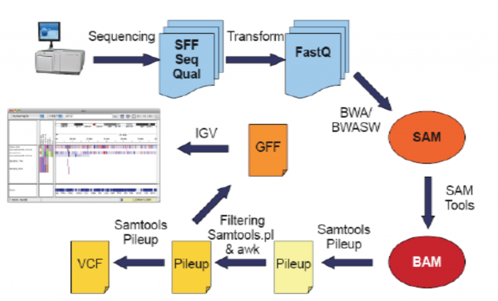
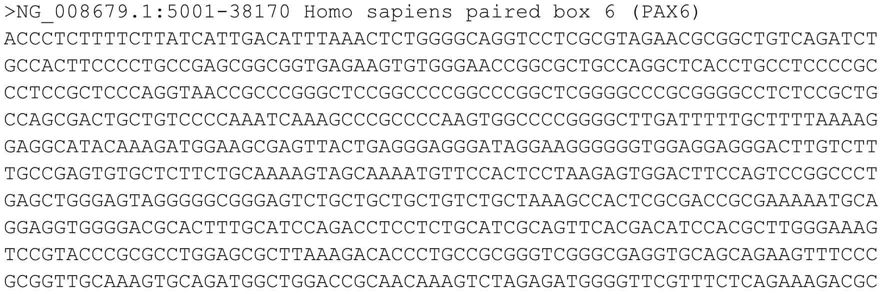
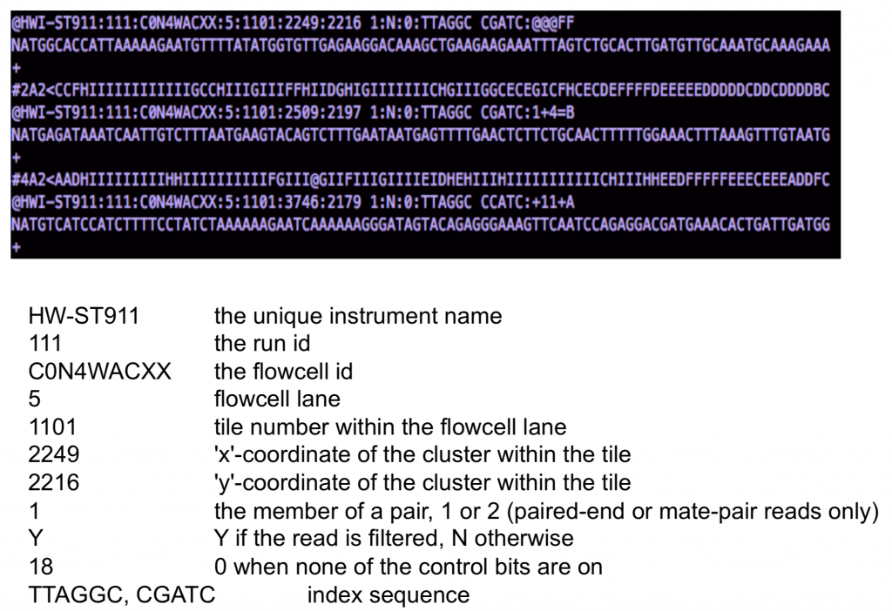
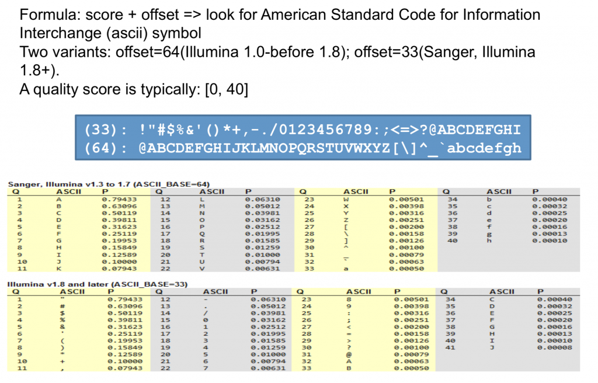
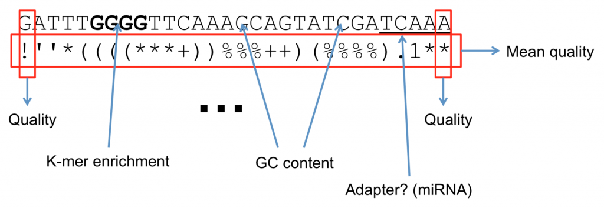
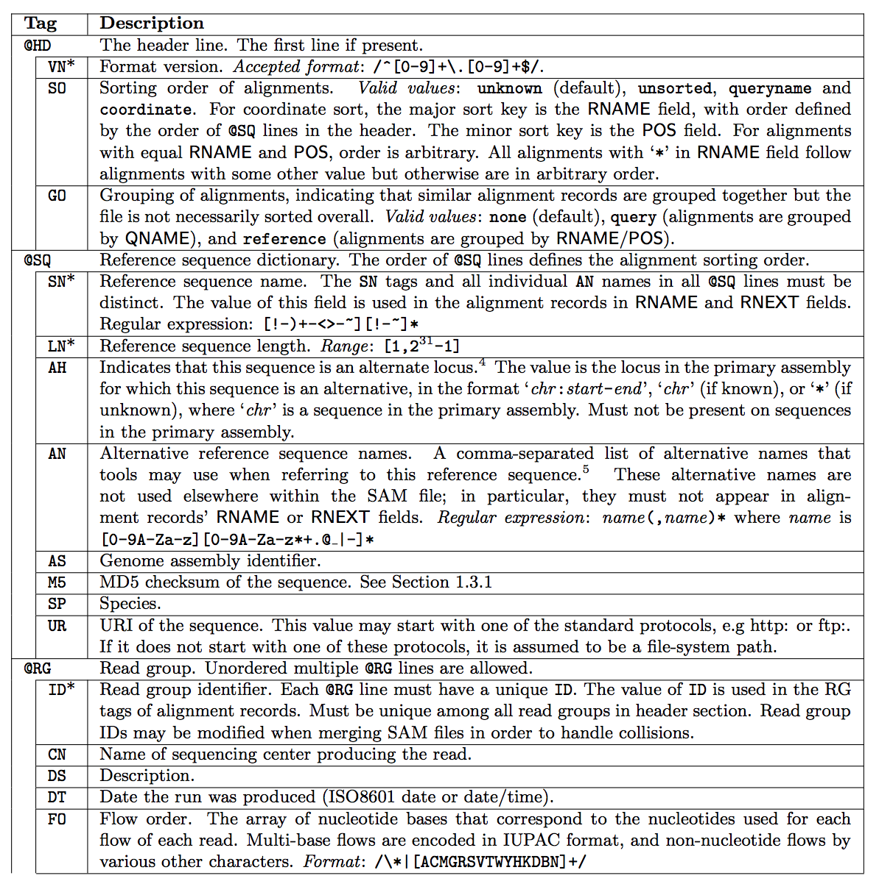
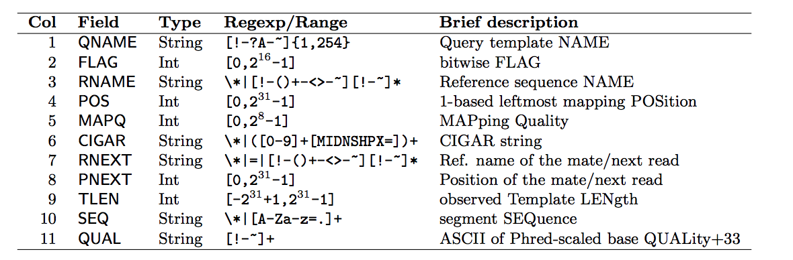
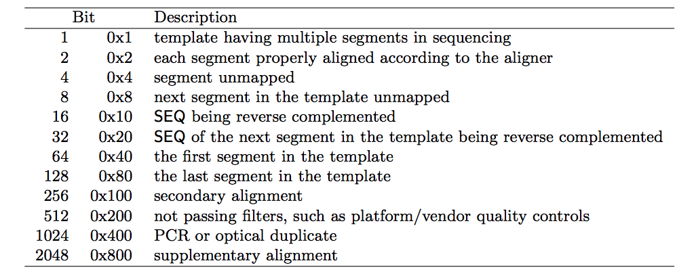

# Lecture 1. Introduction to RNA-Seq technology and data
## Learning objectives
- Get familiar with terminology of RNASeq/HTS (paired-end, single-end, cluster density, FastQ, index, etc).
- Understand Illumina's "Sequencing by synthesis" (SBS) technology.
- Set priorities when planning a sequencing experiment.
- Understand the basics of library prep for HTS.

## Reading Material
### Here are some basics on [NGS technology and file formats](https://learn.gencore.bio.nyu.edu/ngs-file-formats/)

**Definitions:**
**read:** a single sequence produced from a sequencer
**library:** a collection of DNA fragments that have been prepared for sequencing. This generally refers to individual samples
**flowcell:** a chip on which DNA is loaded and provided to the sequencer
**lane:** one portion of a flow cell. Usually used for technical replicates or different samples
**run:** an entire sequencing reaction from start to finish
**NGS:** Next-generation sequencing refers to second generation sequencing where fragments of DNA are sequenced in parallel and reconstructed for the final sequence information

#### General Sequencing steps in NGS:
1. Sample collection and preparation
2. Amplification
3. BaseCalling

##### **1. Sample Collection and Preparation**
DNA from your sample of interested is isolated and purified. This DNA is then sheared to a certain size, the product of interest is amplified and processed, then sequencing adaptors are ligated (small fragments of DNA that are used to bind the molecules of interest on to the flowcell).

##### **2. Amplification**
The sample can be amplified in either single-end or paired-end sequencing. 

[Here is Ilumina's table on the difference between these sequencing choices](https://www.illumina.com/science/technology/next-generation-sequencing/plan-experiments/paired-end-vs-single-read.html)

   **Paired-end sequencing:**    
**Simple paired-end libraries:** Simple workflow allows generation of unique ranges of insert sizes
**Efficient sample use:** Requires the same amount of DNA as single-read genomic DNA or cDNA sequencing
**Broad range of applications:** Does not require methylation of DNA or restriction digestion; can be used for bisulfite sequencing
**Simple data analysis:** Enables high-quality sequence assemblies with short-insert libraries. A simple modification to the standard single-read library preparation process facilitates reading both the forward and reverse template strands of each cluster during one paired-end read. Both reads contain long-range positional information, allowing for highly precise alignment of reads

   **Single-read sequencing:**     

**Cost-effective uses:** This solution delivers large volumes of high-quality data, rapidly and economically
**Specific applications:** Single-read sequencing can be a good choice for certain methods such as small RNA-Seq or chromatin immunoprecipitation sequencing (ChIP-Seq)

   
Sequencing kits are getting cheaper by the decade, the general consensus seems to always go with paired-end sequencing with genomic assays if in the budget due to higher quality data.    
  
##### **3. Sequencing**
[Illumina Sequencing by Synthesis (SBS) Workflow](https://youtu.be/fCd6B5HRaZ8?si=KBfoI6uNyxmuxgiR)
  
Sometimes you will hear people state that a sample occupies 2 lanes, this means that for an 8 lane flowcell, the remaining 6 will be utilized by other samples submitted by otheres. This is a way to drive down sequencing costs. This may be older terminology as I no longer hear lanes being referred. This may be due to sequencing studies needing need high read counts and the [capacity of each sequencing lane](https://online.stat.psu.edu/stat555/node/13/#:~:text=The%20basic%20sequencing%20unit%20is,the%20amount%20of%20sequencing%20done.)
  
>The basic sequencing unit is a "lane" which essentially holds one sequencing sample.  A set of lanes which are processed together is often called a "plate". A single RNA sample may be split across multiple lanes to increase the amount of sequencing done.  This is uncommon in current RNA-seq studies, because each lane can now sequence 100's of millions of RNA fragments, which is more than sufficient for RNA-seq, but it may be done in studies that need very high read counts.  
>...
> **From Lanes to Samples**
>Our units of analysis are features and RNA samples.  In many studies, sequencing lanes and samples are not the same.  Mapping identifies the features.  We also need to summarize by sample. In some studies, the RNA samples are split across several lanes.  It turns out that the error structure is preserved if we simply sum up the reads from each sample to obtain the total reads for each feature in the sample. In some studies, the RNA samples are barcoded and multiplexed so that several samples are sequenced together.  As the reads are mapped to the reference, the bar codes need to be read so that they can also be assigned to samples.

[Here is a forum link discussing lanes](https://www.biostars.org/p/48906/)
[Here is a seconday link discussing lanes](https://bioinformatics.stackexchange.com/questions/4564/relationship-between-sequencing-lane-and-ngs-dataset)
   
Other context regarding lane
A flow cell contains 8 lanes
Each lane contains 2 columns
Each column contains up to 50 tiles
Each tile is imaged 4 times per cycle, one image per base
Each image is 2.5-3.0 Mb, and ~115,000 images are produced per 36 cycles

#### File formats
##### **FastA**
Official FastA documentation [FastA](https://blast.ncbi.nlm.nih.gov/Blast.cgi?CMD=Web&PAGE_TYPE=BlastDocs&DOC_TYPE=BlastHelp)
- This is the most basic format for reporting a sequence and is accepted by all sequence analysis programs.
- Contains 2 lines:
1. The first is the sequence header, which always starts with a ‘>’
- Everything from the beginning ‘>’ to the first whitespace is considered the sequence identifier. Everything after that is considered the sequence description (this can be metadata, machine serial number, read orientation, etc.)
2. The sequence itself 
- Note that the sequence can span multiple lines, depending on the length of the sequence.
  
**Softwares that use FastA**    
- Reference genome
- DB query tools like BLAST and multiple-sequence alignment algorithms

   **File generation**     
- Some NGS sequencers report in FastA
- Sanger Sequencers
- Most sequence databases store in FastA and is made available for download in this format
- Can be generated from FastQ files

This is what FastA looks like  

  
You can grab and explore a FastA file:  
Generally you will download a reference genome. You can find it here: ftp://ftp.wormbase.org/pub/wormbase/species/c_elegans/sequence/genomic/c_elegans.WS236.genomic.fa.gz
  
Download it onto the cluster in a new folder in your scratch called file_formats. Unzip this and look at the size. What command would you use to open it?
  
##### **FastQ**     
Official FastQ format [FastQ](http://maq.sourceforge.net/fastq.shtml)
   

The most widely used sequence format in sequence analysis and is generally delivered by sequencers in this format. Many analysis tools require this format because it contains more information than FastA.
  
FastQ contains 4 lines of syntax:  
1. The first line is the sequence header which starts with an ‘@’ (not a ‘>’!).
- Everything from the leading ‘@’ to the first whitespace character is considered the sequence identifier. Everything after the first space is considered the sequence description
2. The second line is the sequence.
3. The third line starts with ‘+’ and can have the same sequence identifier appended (but usually doesn’t anymore).
4. The fourth line are the quality scores

This is an image of what FastQ looks like

Here is another example of a FastQ

   

**What software use FastQ?**
   
Nearly everything works with this format. Some common examples are:
- Aligners: Bowtie, Tophat2
- Assemblers: Velvet, Spades
- QC tools: Trimmomatic, FastQC
   
I think it’s a shorter list to tell you what does not work with FastQ files. Please note that there are tools available to convert FastQ to FastA in the event that FastQ is incompatible with the tool you’re using:
   
- Blast
- Multiple Sequence Aligners
- Any reference sequence
   

**How are these files generated?**
   

Sequencers generate this format by default.
This can also be generated from a few different file formats (BAM, SFF, HDF5), though they all were some form of FastQ at some point.
   

**Let’s grab one!**
Type this into your terminal
`cp /scratch/courses/HITS-2018/file_formats/208_1_merged.fastq $SCRATCH/file_formats/`

Check the size of this. What program would you use to view it?

##### **Quality Scores**
[More regarding Quality Scores from Illumina](Relativelinks/technote_Q-Scores.pdf)
Quality scores are a way to assign confidence to a particular base within a read. Some sequencers have their own proprietary quality encoding but most have adopted Phred-33 encoding. Each quality score represents the probability of an incorrect basecall at that position.

These scores provide also insight into the library prepartion, read alignment, and variant calling along with confidence in basecalling.

Historically, Phred originated as an algorithm to takes Sanger Sequencing metrics and links them to known accuracy through a large multivariate lookup table. This method has been highly accurate across a range of sequencing chemistries and instruments, thus making it a standard in assessing sequencing quality today.

Phred Quality scores are encorded in ASCII.

These scores can be interpreted as:
 

   

**What are Quality Scores Good for?**
   
As we mentioned earlier, many programs require the FastQ format, implying that they will use the quality score in a particular part of the analysis. Common uses are to filter bases or entire reads if a particular quality threshold isn’t met. An example of a threshold is the mean quality score for the read. That is: what’s the average score of all bases for an individual read? If the average Phred quality score is 10, what does that mean? Is this good enough to do SNP analysis?

   

**What Software use Quality Scores?**
The main purpose for these scores is to further provide evidence that the sequence, alignment, assembly, SNP are in fact real and not due to a problem in generating the sequences.
   

- Almost every QC software package use these.
- Variant detection/SNP calling algorithms
- Assemblers
- Aligners

#### **SAM/BAM/CRAM Format**
   

Official documentation here 
[SAM](./Relativelinks/SAMv1.pdf)

These formats were introduced to standardize how alignments are reported. Initially there were many different formats, most of them proprietary, which were space inefficient and either held too much or too little information. The first of these to be introduced was Sequence Alignment Map (SAM). With this format not only is the alignment retained but the associated quality scores (both mapping and base quality), the original read itself, paired-end information, sample information, and many more features.
  

**SAM Format**
   

This is the most basic, human readable format of the three. This is generated by almost every alignment algorithm that exists. It consists of a header, a row for every read in your dataset, and 11 tab-delimited fields describing that read.
  

**SAM Header**
   

The header varies in size but adheres to a particular format depending on what information you decide to add. Some example information that can be entered into the header is: command that generated the SAM file, SAM format version, sequencer name and version. The full list of available header fields can be found below.

   

**Field Descriptions**
Each row contains 11 mandatory fields. The descriptions for them can be found below:
   

   

Let’s look at some of the fields that aren’t very self explanatory:
   

**Bitwise Flag**
   
The bitwise flag is a lookup code to explain certain features about the particular read (exact same concept as Linux permission codes!). It tells you whether the read aligned, is marked a PCR duplicate, if it’s mate aligned, etc. and any combination of the available tags, seen below:

   
One important thing to note is that any combination of these flags results in one integer, which makes interpreting it a bit difficult. To make it easy you can check [here](https://broadinstitute.github.io/picard/explain-flags.html) to either encode or decode a bitwise flag.

   

**MapQ (Mapping Quality)**
   

This value reports how well the read aligned to the reference. Different algorithms report it differently but nonetheless, the greater the number the better the alignment (generally).
   

**CIGAR  String**
   

This is a shorthand way to encode an entire alignment. Instead of writing the whole alignment out, operators have been defined and are used in combination with numbers to explain which part of the sequence aligns, which doesn’t, and everything in between. The definition for the operators can be found here:

